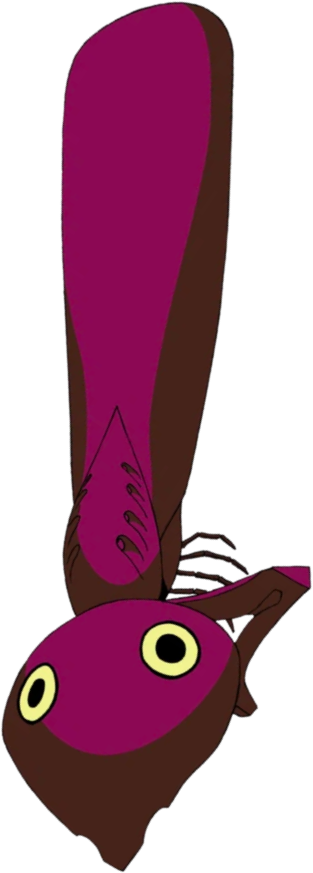
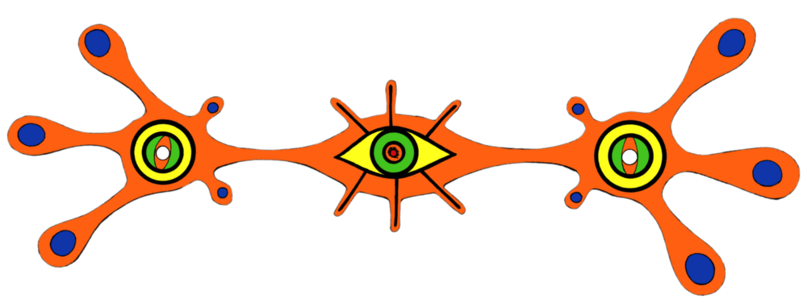
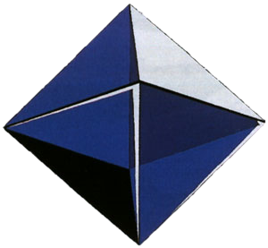
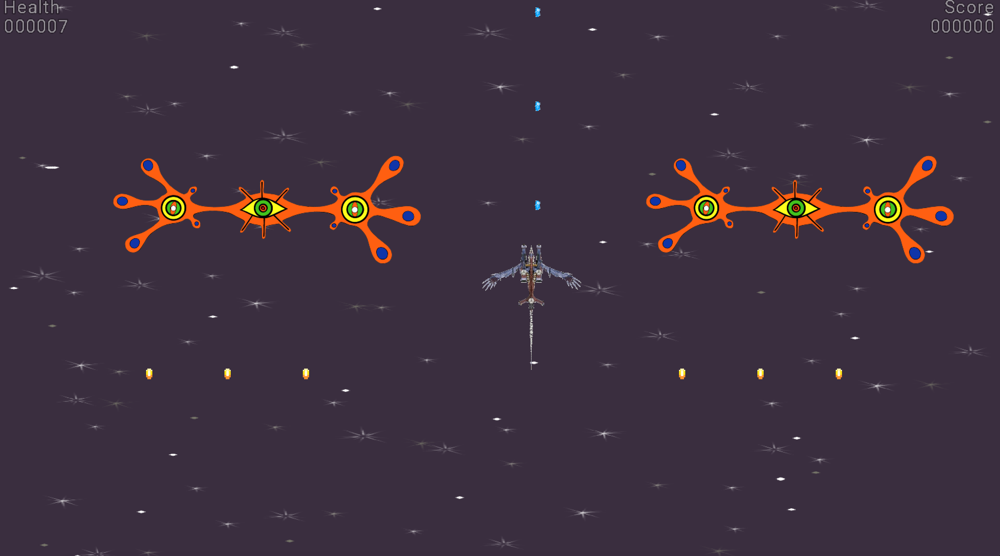
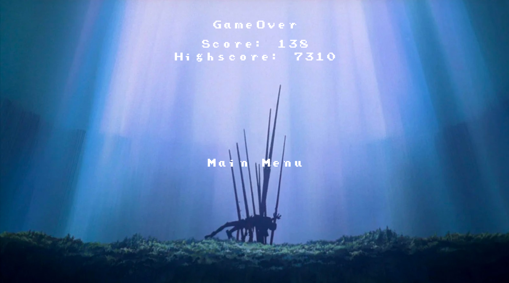
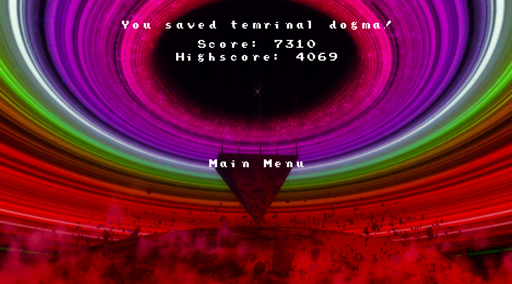

# True Evangelion fan game  + libgdx tutorial

  
English

  ### This is a shoot 'em up game where you kill angels using AAA Wunder.
  
  ### Enemies
  Here is some information about the enemies, including how many points you get for killing them and their health (how many hits they can take)
  
  <table>
<thead>
  <tr>
    <th>Name</th>
    <th>Image</th>
    <th>Points</th>
    <th>Health</th>
  </tr>
</thead>
<tbody>
  <tr>
    <td>Shamshel</td>
    <td></td>
    <td>69</td>
    <td>5</td>
  </tr>
  <tr>
    <td>Sahaquiel</td>
    <td></td>
    <td>228</td>
    <td>10</td>
  </tr>
  <tr>
    <td>Leliel</td>
    <td></td>
    <td>1337</td>
    <td>15</td>
  </tr>
  <tr>
    <td>Ramiel</td>
    <td></td>
    <td>1488</td>
    <td>25</td>
  </tr>
</tbody>
</table>
  
  
  

  
Русский

  ### Это игра в жанре shoot 'em up, где вы сражаетесь с ангелами.
  
  ### Противники
  Вот немного информации о противниках включая сколько очков вы получите за их убийство и их здоровье (сколько попаданий они могут выдержать)
  
  
  <table>
<thead>
  <tr>
    <th>Имя</th>
    <th>Изображение</th>
    <th>Очки</th>
    <th>Здоровье</th>
  </tr>
</thead>
<tbody>
  <tr>
    <td>Самусиил</td>
    <td></td>
    <td>69</td>
    <td>5</td>
  </tr>
  <tr>
    <td>Сахакиил</td>
    <td></td>
    <td>228</td>
    <td>10</td>
  </tr>
  <tr>
    <td>Леиил</td>
    <td></td>
    <td>1337</td>
    <td>15</td>
  </tr>
  <tr>
    <td>Рамиил</td>
    <td></td>
    <td>1488</td>
    <td>25</td>
  </tr>
</tbody>
</table>
  

<!-- 

  
Reviews / Отзывы 

  a
  

 -->

